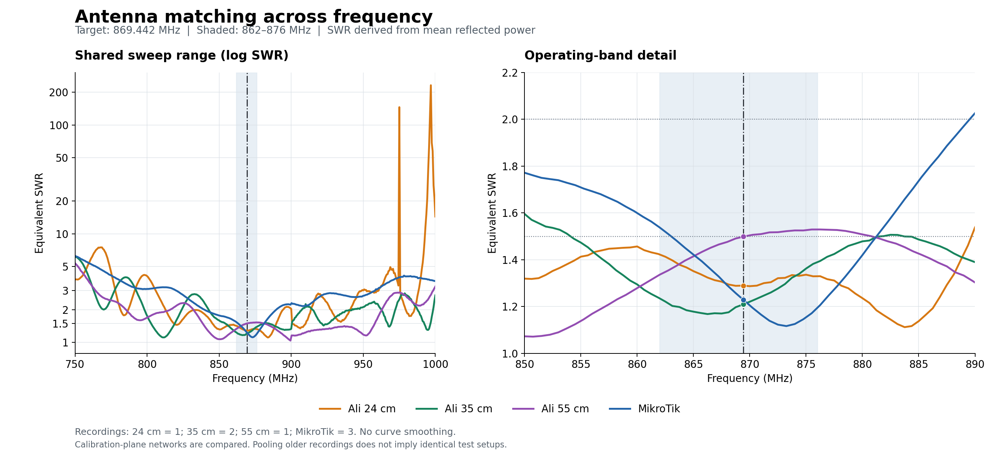
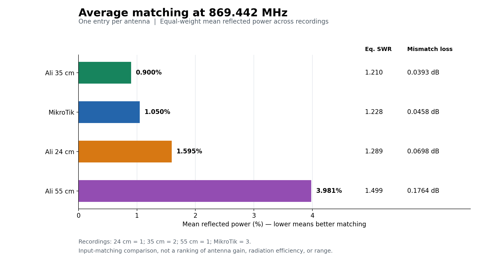

# 868 MHz antenna comparison — measurements at 869.442 MHz

Four antenna summaries derived from seven NanoVNA Touchstone S1P recordings and two CSV files. Target frequency: **869.442 MHz (869,442,000 Hz)**. Analysis date: October 1, 2026.

> **Repeated recordings are consolidated into one entry per antenna. The 35 cm summary uses two recordings; MikroTik uses three. Matching is averaged in the reflected-power domain. “Best matching point” means minimum SWR / maximum return loss, not maximum gain, radiation efficiency, or range.**

## 1. Antennas and advertised specifications

| Antenna | Model | Advertised gain | Advertised frequency range | Advertised SWR | Connector | S1P recordings |
| --- | --- | --- | --- | --- | --- | --- |
| Ali 24 cm | Not specified | 5 dBi | 868/915 MHz [1] | <=2 | N-male | 1 |
| Ali 35 cm | GT-BLG20-350-868 | 5.8 dBi | 840–890 MHz | <=1.5 | N-male | 2 |
| Ali 55 cm | GT-BLG20-550-868 | 8 dBi | 840–890 MHz | <=1.5 | N-male | 1 |
| MikroTik | 868 Omni antenna | 6.5 dBi | 862–876 MHz | Not specified on product page | SMA-female | 3 |

Gain figures are seller/manufacturer claims, not measured gain results. MikroTik also specifies a 360° horizontal beamwidth, 30° vertical beamwidth, and IP66 protection. The 24 cm listing claims IP67, but contains the inconsistent dimension “20×3000 mm”. The 35/55 cm listings specify vertical polarization, a 2 cm diameter, and a maximum power rating of 50 W. These properties were not tested.

[1] “868/915 MHz” may refer to separate selectable versions rather than one antenna covering both frequency ranges.

Product references:

- [Ali 35/55 cm](https://www.aliexpress.com/item/1005011948586639.html) — specifications from the supplied listing screenshots.
- [Ali 24 cm](https://www.aliexpress.com/item/1005009284785977.html) — specifications from the supplied listing text.
- [MikroTik 868 Omni antenna](https://mikrotik.com/product/868_omni_antenna) — official product page.

## 2. Test setup and calibration reference plane

The 24 and 35 cm antennas were measured at the same physical location using a magnetic SMA mount. Calibration was performed at the mount's SMA connector, **before** the following adapter chain:

`Calibrated SMA mount → SMA male–male → SMA female / RP-SMA male → RP-SMA female / N → antenna`

Correct center-contact mating was confirmed. Calibration compensates for the cable/mount up to the reference plane, provided its configuration remained substantially unchanged. The adapters after that plane remain part of the measured network.

- Results describe the **adapter chain plus antenna**, not the antenna connector alone.
- Additional electrical length changes S11 phase and the inferred impedance. An ideal lossless 50-ohm line does not change SWR.
- Adapter losses and discontinuities can change measured SWR. Loss also attenuates the reflected wave.
- The same adapter chain improves comparability of the 24/35 cm results, but does not eliminate interactions with the installation.
- Identical setup/calibration has not been established here for the older 55 cm and MikroTik recordings. Pooling them provides a descriptive summary across recordings, not a controlled same-location test or a single characterized installation.

## 3. Averaging repeated recordings

At each frequency, the recorded reflected-power fractions are averaged with equal weight:

```text
p_mean(f) = mean(abs(S11_i(f))^2)
Gamma_RMS(f) = sqrt(p_mean(f))
SWR_equivalent(f) = (1 + Gamma_RMS(f)) / (1 - Gamma_RMS(f))
Return_loss_dB(f) = -10 * log10(p_mean(f))
Mismatch_loss_dB(f) = -10 * log10(1 - p_mean(f))
```

The resulting SWR is a **power-equivalent summary**, not the arithmetic mean of individual SWR values. Return loss and mismatch loss are derived from the same mean power, so the matching metrics remain mutually consistent. Complex S11 values are not averaged across recordings: different phases could cancel and artificially suggest better matching. The averaged curve is not a new physical antenna or measurement. For one-recording antennas, the results are unchanged.

At 869.442 MHz and other selected frequencies, real and imaginary S11 are first interpolated separately **within each recording**, then the reflected-power fractions are averaged. On the frequency plots, averaging uses the original common sample grid within each antenna group.

## 4. Main comparison at 869.442 MHz

| Antenna | Recordings | Equivalent SWR | Equivalent S11 (dB) | Return loss (dB) | Mean reflected power (%) | Non-reflected power (%) | Mismatch loss (dB) |
| --- | --- | --- | --- | --- | --- | --- | --- |
| Ali 24 cm | 1 | 1.289 | -17.97 | 17.97 | 1.595 | 98.405 | 0.0698 |
| Ali 35 cm | 2 | 1.210 | -20.46 | 20.46 | 0.900 | 99.100 | 0.0393 |
| Ali 55 cm | 1 | 1.499 | -14.00 | 14.00 | 3.981 | 96.019 | 0.1764 |
| MikroTik | 3 | 1.228 | -19.79 | 19.79 | 1.050 | 98.950 | 0.0458 |

More negative S11 in dB, or a higher positive return loss, means less reflection.

**Non-reflected power is not radiated power.** It includes power that may be radiated as well as power dissipated in adapters/antenna. Mismatch loss excludes cable insertion loss and radiation-efficiency losses.

### Comparative plots



The left panel shows the shared 750–1000 MHz sweep range on a logarithmic SWR axis. The right panel expands 850–890 MHz on a linear axis. The shaded band is 862–876 MHz; the vertical line marks **869.442 MHz**. Each antenna has one curve. The 35 cm and MikroTik curves use the averaging method above. The recordings starting at 700 MHz extend below the displayed shared range. No smoothing is applied. Target markers use interpolated complex S11 within each recording before averaging power.



Bars show mean reflected power. Equivalent SWR and mismatch loss are shown alongside each antenna. This is an input-matching comparison, not a gain or range ranking.

## 5. Impedance summary and variation across recordings

| Antenna | Mean R (ohm) | Mean X (ohm) | Mean complex impedance (ohm) | RMS reflection magnitude | Observed SWR range at target |
| --- | --- | --- | --- | --- | --- |
| Ali 24 cm | 38.85 | +1.28 | 38.85 +1.28j | 0.12628 | 1.289–1.289 |
| Ali 35 cm | 41.91 | -2.74 | 41.91 -2.74j | 0.09486 | 1.179–1.237 |
| Ali 55 cm | 33.50 | +2.31 | 33.50 +2.31j | 0.19952 | 1.499–1.499 |
| MikroTik | 48.96 | +9.98 | 48.96 +9.98j | 0.10245 | 1.196–1.270 |

R and X are arithmetic means of the impedances calculated separately from each recording. They are **descriptive summaries at the calibration planes**, not the impedance of a synthetic averaged network. Do not calculate the equivalent SWR from this mean impedance: the equivalent matching metrics above come from mean reflected power. The observed SWR range describes recorded spread, not instrument uncertainty or a confidence interval. For single recordings the range collapses to one value.

Positive X indicates inductive behavior and negative X indicates capacitive behavior at the measurement plane. Adapter electrical length changes these values, so they should not be attributed directly to the antenna feedpoint or used alone to design a matching network. Phase is omitted for the consolidated entries because power averaging does not define an equivalent phase.

## 6. Best matching frequencies

| Antenna | Full-sweep minimum: MHz | Minimum equivalent SWR | Return loss there (dB) | Best sample in 862–876 MHz | Equivalent SWR there | Offset from 869.442 MHz [2] |
| --- | --- | --- | --- | --- | --- | --- |
| Ali 24 cm | 883.750 | 1.112 | 25.52 | 870.000 | 1.287 | +0.558 MHz |
| Ali 35 cm | 811.875 | 1.114 | 25.39 | 866.250 | 1.168 | -3.192 MHz |
| Ali 55 cm | 899.500 | 1.041 | 33.88 | 862.000 (boundary) | 1.336 | -7.442 MHz |
| MikroTik | 873.250 | 1.116 | 25.19 | 873.250 | 1.116 | +3.808 MHz |

[2] Offset of the best sample within 862–876 MHz from the target. Minima are found on each antenna's mean-power sample curve, without sub-sample fitting. They are not averages of the individual minimum frequencies.

- **Ali 24 cm:** full-sweep best matching sample at **883.750 MHz**, with equivalent SWR **1.112**; best sample in 862–876 MHz at **870.000 MHz**, with SWR **1.287**.
- **Ali 35 cm:** full-sweep best matching sample at **811.875 MHz**, with equivalent SWR **1.114**; best sample in 862–876 MHz at **866.250 MHz**, with SWR **1.168**.
- **Ali 55 cm:** full-sweep best matching sample at **899.500 MHz**, with equivalent SWR **1.041**; best sample in 862–876 MHz at **862.000 MHz**, with SWR **1.336**.
- **MikroTik:** full-sweep best matching sample at **873.250 MHz**, with equivalent SWR **1.116**; best sample in 862–876 MHz at **873.250 MHz**, with SWR **1.116**.

For the 55 cm antenna, the best sample inside 862–876 MHz is at the lower boundary, not an identified interior minimum. Minimum SWR does not necessarily coincide with zero reactance, so it is not automatically described as the antenna's resonance frequency. The 35 cm curve has more than one well-matched region; its full-sweep minimum is outside the operating window.

## 7. Continuous matching bandwidth containing 869.442 MHz

Only continuous intervals containing the target are reported, not the combined width of all well-matched regions. Bounds use linear interpolation of RMS reflection magnitude at the SWR threshold crossings on each antenna's consolidated curve.

| Antenna | Equivalent SWR <=1.2 (MHz) | Equivalent SWR <=1.5 (MHz) | Width <=1.5 (MHz) | Equivalent SWR <=2 (MHz) | Width <=2 (MHz) |
| --- | --- | --- | --- | --- | --- |
| Ali 24 cm | Target excluded | 845.26–889.69 | 44.44 | 812.83–894.31 | 81.48 |
| Ali 35 cm | Target excluded | 854.08–881.65 | 27.57 | 842.72–907.31 | 64.60 |
| Ali 55 cm | Target excluded | 838.54–869.58 | 31.04 | 832.13–962.85 | 130.72 |
| MikroTik | Target excluded | 863.01–881.26 | 18.25 | 839.86–889.53 | 49.67 |

These intervals characterize the averaged curve and do not guarantee that every individual recording remains below the threshold throughout the interval. A wider matching bandwidth does not establish greater gain or efficiency. Two decimal places in the bounds are a reporting convention, not demonstrated instrument accuracy.

## 8. Equivalent SWR at selected frequencies

| Antenna | 860 MHz | 868 MHz | 869.442 MHz | 870 MHz | 873.250 MHz | 876 MHz | 915 MHz |
| --- | --- | --- | --- | --- | --- | --- | --- |
| Ali 24 cm | 1.457 | 1.296 | 1.289 | 1.287 | 1.325 | 1.329 | 2.211 |
| Ali 35 cm | 1.295 | 1.174 | 1.210 | 1.221 | 1.301 | 1.389 | 1.991 |
| Ali 55 cm | 1.278 | 1.476 | 1.499 | 1.504 | 1.522 | 1.529 | 1.289 |
| MikroTik | 1.599 | 1.291 | 1.228 | 1.205 | 1.116 | 1.194 | 2.356 |

The 24 cm recording gives **SWR 2.211 at 915 MHz**, so it does not confirm SWR <=2 there. That does not establish a misleading listing if 868 and 915 MHz refer to separate versions. The 55 cm recording also shows good matching at 915 MHz, but gain and radiation pattern there remain unverified.

## 9. Practical significance of the differences

- **24 versus 35 cm:** the 35 cm mean curve is better matched at the target, but the mismatch-loss difference is only **0.0306 dB**. This does not prove better range.
- **55 versus 35 cm:** the mismatch-loss difference is **0.1372 dB**. If the 55 cm antenna genuinely has higher gain, this small reflection penalty would not cancel that advantage.
- **MikroTik versus 35 cm:** the mismatch-loss difference is only **0.0066 dB**. Their consolidated matching is effectively very similar for communication purposes.
- The best-to-worst difference is **0.1372 dB**, considering matching alone.

Consolidated matching order at 869.442 MHz:

**Ali 35 cm → MikroTik → Ali 24 cm → Ali 55 cm.**

This ranks the consolidated input matching, not overall antenna gain, efficiency, or range.

## 10. What the CSV files show — and what they do not

Each CSV contains 450 samples. The first column spans 750–1000 with a step of approximately 0.5568. No headers, units, or instrument metadata are included. The first column is provisionally treated as MHz; the second remains a **value in unknown units**. It is not identified as dBm or S11. No repeated CSV recordings are available to average.

| Antenna | Samples | Frequency of highest value (MHz*) | Highest value | Highest value in 868–870: MHz* | Value | Value range in 868–870 |
| --- | --- | --- | --- | --- | --- | --- |
| Ali 24 cm | 450 | 954.900 | -58.594 | 868.040 | -91.750 | -94.313 to -91.750 |
| Ali 35 cm | 450 | 784.521 | -55.500 | 869.154 | -90.813 | -92.375 to -90.813 |

*Under the provisional interpretation above. Maxima refer to CSV values, not maximum antenna performance.*

| Frequency (MHz*) | 24 cm: CSV value | 35 cm: CSV value | 35 minus 24 (CSV units) |
| --- | --- | --- | --- |
| 868.040039 | -91.750 | -92.375 | -0.625 |
| 868.596863 | -94.313 | -91.813 | +2.500 |
| 869.153687 | -93.750 | -90.813 | +2.937 |
| 869.710449 | -91.813 | -91.375 | +0.438 |

These four frequencies are approximately 557 kHz apart and do not include 869.442 MHz. No power interpolation at the target is attempted: without RBW, detector, timing, or source information, interpolation would not reliably describe a narrowband or intermittent transmission. Even if these are spectrum sweeps, a higher level can represent a stronger desired signal, greater interference, or a different measurement time. No antenna-gain estimate is derived from these files.

## 11. Source files, calculations, and frequency resolution

All S1P headers state `# Hz S RI R 50`: frequencies in Hz, S-parameters in real/imaginary form, and a 50-ohm reference impedance. Each recording contains 401 samples. Source recordings are grouped below to keep one row per antenna.

| Antenna | Input files | Recordings | Sweep range (MHz) | Step (MHz) | Samples per recording |
| --- | --- | --- | --- | --- | --- |
| Ali 24 cm | `KONTH_11026.s1p` | 1 | 750–1000 | 0.625 | 401 |
| Ali 35 cm | `35CM_11026.s1p`<br>`35CM_11026_2.s1p` | 2 | 750–1000 | 0.625 | 401 |
| Ali 55 cm | `ALI_868_080926(1).s1p` | 1 | 700–1000 | 0.750 | 401 |
| MikroTik | `MIKROTIK_OMNI_270826(1).s1p`<br>`MIKROTIK_ISTOS1_10926(1).s1p`<br>`MIKROTIK_ISTOS2_10926(2).s1p` | 3 | 700–1000 | 0.750 | 401 |

869.442 MHz is not an original sample in any file. Real and imaginary S11 are interpolated separately within each recording; averaging is then performed in the power domain. Results are estimates from sweeps spaced 625 or 750 kHz apart. Displayed decimal precision does not imply equivalent measurement accuracy.

Derived matching quantities:

```text
p_mean = mean(abs(Gamma_i)^2)
Gamma_RMS = sqrt(p_mean)
SWR_equivalent = (1 + Gamma_RMS) / (1 - Gamma_RMS)
S11_equivalent_dB = 10 * log10(p_mean)
Return_loss_dB = -10 * log10(p_mean)
Mean_reflected_power_percent = 100 * p_mean
Non_reflected_power_percent = 100 * (1 - p_mean)
Mismatch_loss_dB = -10 * log10(1 - p_mean)
Z_i = 50 * (1 + Gamma_i) / (1 - Gamma_i)
Mean_Z = mean(Z_i)  # descriptive only; not used for SWR
```

## 12. Conclusions and useful follow-up tests

1. **All four antenna summaries show very good matching at 869.442 MHz**, with equivalent SWR 1.210–1.499.
2. The consolidated 35 cm and MikroTik results are close, followed by the 24 cm antenna; the mismatch-loss differences are very small.
3. The 55 cm antenna shows greater reflection at the target, but only about 0.176 dB mismatch loss. It could still outperform the others in certain directions because of a different gain/pattern.
4. Measured gain, radiation efficiency, polarization, weatherproofing, and range cannot be established from these data.
5. Consolidation is a descriptive summary across supplied recordings, not a statistically established antenna specification. The unequal recording counts and setup differences should be considered when comparing antennas.
6. For real communication comparisons, use the same node, cable, location, and orientation; fixed remote targets; and repeated **A–B–A** swaps. Record RSSI/SNR and packet success with comparable packets, preferably direct links with identical modulation and transmit power. Track mesh route changes separately.
7. For more precise S11 at the target, perform a narrower sweep around 869.442 MHz and ideally calibrate OPEN–SHORT–LOAD at the final antenna connector.

## Using this report on GitHub

Place this Markdown file and both PNGs in the same repository directory:

```text
ANTENNA_COMPARISON_869442.md
swr_comparison.png
matching_at_869442.png
```
