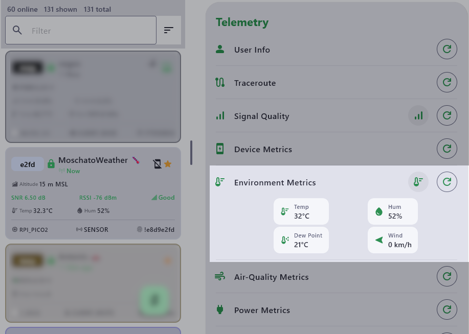

# Meshtastic Weather Bridge

A small Python bridge that forwards weather data received via rtl_433/MQTT to a Meshtastic node as native Environment Metrics telemetry.  
This project was originally developed and tested with a Bresser 5-in-1 weather station.  
  
The current Bresser setup provides:  

- Temperature
- Humidity
- Wind speed
- Maximum wind gust during the reporting interval
- Wind direction

Note that the barometric pressure sensor is located in the indoor display unit, so pressure data is not transmitted over RF.  

Weather telemetry is broadcast periodically (default: **15 minutes**) to avoid unnecessary LoRa traffic.

The bridge can also respond to **on-demand Meshtastic Environment Metrics requests**.


## Requirements

- Python 3
- `rtl_433` publishing weather station data to MQTT
- MQTT broker
- Meshtastic Python library

Install Python dependencies:

```bash
python3 -m venv venv
./venv/bin/pip install -r requirements.txt
```

Alternatively, the required packages can be installed manually:

```bash
python3 -m venv venv
./venv/bin/pip install meshtastic paho-mqtt pypubsub
```

## Configuration

An example configuration file is included as `weather-meshtastic.env.example`.

Copy it to the default configuration filename:

```bash
cp weather-meshtastic.env.example weather-meshtastic.env
```

Then edit `weather-meshtastic.env` to configure your MQTT server, weather station sensor ID, and Meshtastic TCP endpoint:

```ini
WEATHERSTATION_MQTT_IP=192.168.1.100
WEATHERSTATION_MQTT_PORT=1883
WEATHERSTATION_MQTT_USERNAME=mqtt_user
WEATHERSTATION_MQTT_PASSWORD=change_me
WEATHERSTATION_SENSOR_ID=123456789

MESH_HOST=127.0.0.1
MESH_PORT=4405

SEND_INTERVAL=900
MAX_DATA_AGE=180
MESH_RECONNECT_INTERVAL=10
```

The default installation expects this configuration file to be located at:

```text
/opt/weather-meshtastic/weather-meshtastic.env
```
  
## Using a Meshtastic Node Directly

MeshMonitor is **not required**. The bridge can connect directly to any Meshtastic device that provides the TCP interface over Wi-Fi or Ethernet.

To bypass MeshMonitor, enable the network connection on your Meshtastic device and make sure it is reachable from the machine running this bridge. Meshtastic normally exposes its TCP API on **port 4403**.

Then change the following values in `/opt/weather-meshtastic/weather-meshtastic.env`:

```ini
MESH_HOST=192.168.1.123
MESH_PORT=4403
```

Replace `192.168.1.123` with the IP address of your Meshtastic device.

The resulting data path becomes:

```text
Bresser Weather Station
        ↓ RF
     rtl_433
        ↓ MQTT
    weather.py
        ↓ TCP :4403
Meshtastic Node
        ↓ LoRa
      Mesh
```

No changes to `weather.py` are required.

> **Note:** When using a direct connection, the Meshtastic node must remain reachable over the network. If another application is already using the node's TCP interface, verify that your setup supports the additional connection. MeshMonitor's Virtual Node can be useful when you want to keep the physical node connection managed by MeshMonitor while exposing a separate TCP endpoint to this bridge.

## Install

The default paths expect the project to be installed in:

```text
/opt/weather-meshtastic
```

Install and enable the systemd service:

```bash
sudo cp weather-meshtastic.service /etc/systemd/system/
sudo systemctl daemon-reload
sudo systemctl enable --now weather-meshtastic.service
```

Check the service status:

```bash
systemctl status weather-meshtastic.service
```

Watch the logs:

```bash
journalctl -u weather-meshtastic.service -f
```

## Data Flow with MeshMonitor

```text
Bresser Weather Station
        ↓ RF
     rtl_433
        ↓ MQTT
    weather.py
        ↓ TCP
MeshMonitor Virtual Node
        ↓
    Meshtastic
        ↓ LoRa
      Mesh
```

MQTT data is collected continuously, but by default only **one Environment Metrics packet is transmitted every 15 minutes**.

The maximum wind gust observed during each reporting interval is retained and included in the transmitted telemetry.

On-demand Environment Metrics requests received through Meshtastic are answered using the latest available weather data.

---

## Note About My Setup

My existing setup is the following:

- A **Bresser 5-in-1 weather station**, 868 MHz version  
  https://www.bresser.com/p/bresser-weather-station-5-in-1-beaufort-7002525
- An **RTL-SDR dongle connected to a Linux server**, which receives the weather station transmissions using `rtl_433`
- `rtl_433` decodes the weather data and publishes it via **MQTT**
- **Home Assistant** receives the MQTT data, where the weather station is already available and monitored

The goal of this project was to add **Meshtastic support without changing the existing weather-station infrastructure**.

Instead of replacing or modifying the current setup, this bridge simply reuses the weather data already available through MQTT and forwards it to the Meshtastic network as native Environment Metrics.

The resulting data path is:

```text
Bresser 5-in-1
      ↓ 868 MHz
   RTL-SDR
      ↓
   rtl_433
      ↓ MQTT
   MQTT Broker
      ├──→ Home Assistant
      │
      └──→ weather.py
               ↓ TCP
         MeshMonitor Virtual Node
               ↓
         Raspberry Pi Pico 2 W
               ↓ LoRa
         Meshtastic Network
```

In my installation, a **Raspberry Pi Pico 2 W running Meshtastic** is used as the LoRa node.  

I already run **MeshMonitor on the same Linux server**, connected to this Meshtastic device. Instead of opening another direct connection to the physical node, the bridge connects to a **MeshMonitor Virtual Node**.

This allows the bridge to maintain its own Meshtastic TCP connection through the Virtual Node while MeshMonitor continues to use and manage its existing connection to the physical device.

This is only how **my particular setup** is configured. **MeshMonitor is not required by this project.**

As described above, the bridge can also connect **directly to a Meshtastic device** over its TCP interface (normally port `4403`). In that case, simply configure the device's IP address and TCP port instead of the MeshMonitor Virtual Node address and port.

This allows the same Bresser weather data to remain available in Home Assistant while also being shared over the Meshtastic network, without requiring any changes to the existing Bresser / RTL-SDR / MQTT infrastructure.

---

### Other Weather Stations and Sensors

Although this project was created for my **Bresser 5-in-1**, the same approach can be adapted to many other weather stations and wireless sensors.

In general, any weather station or sensor that transmits its measurements over RF to its original indoor console may be a suitable candidate, provided that its protocol can be received and decoded — for example, by `rtl_433`.

The exact MQTT topics and field names will vary between devices. To use another weather station or sensor, you will need to identify the corresponding MQTT topics and map the available measurements (temperature, humidity, wind speed, wind gust, wind direction, etc.) to the appropriate Meshtastic Environment Metrics fields.

The general concept remains the same:

```text
Weather Station / Wireless Sensor
              ↓ RF
           RTL-SDR
              ↓
           rtl_433
              ↓ MQTT
        Existing MQTT data
              ↓
          weather.py
              ↓
      Meshtastic TCP API
              ↓ LoRa
      Meshtastic Network
```

So the bridge is not fundamentally limited to Bresser hardware. With the appropriate MQTT topic and field mapping, the same concept can be used with other `rtl_433`-supported weather stations or RF sensors, and the script can be adapted to publish whichever measurements are supported by Meshtastic telemetry.

---



---

:copyright: 2026, Antonis Maglaras
